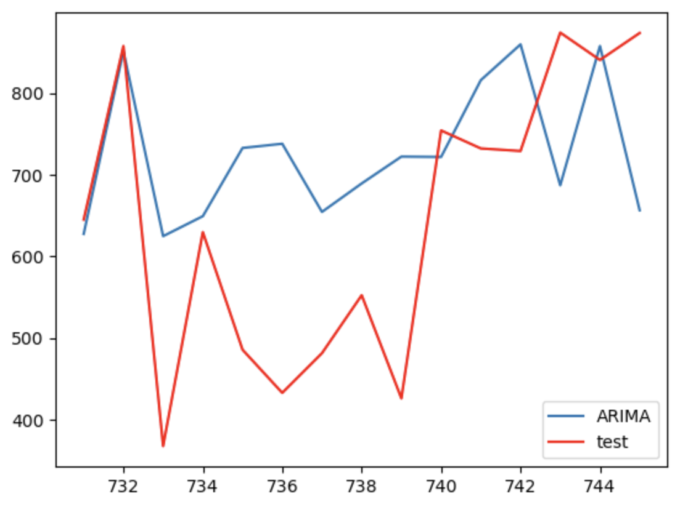
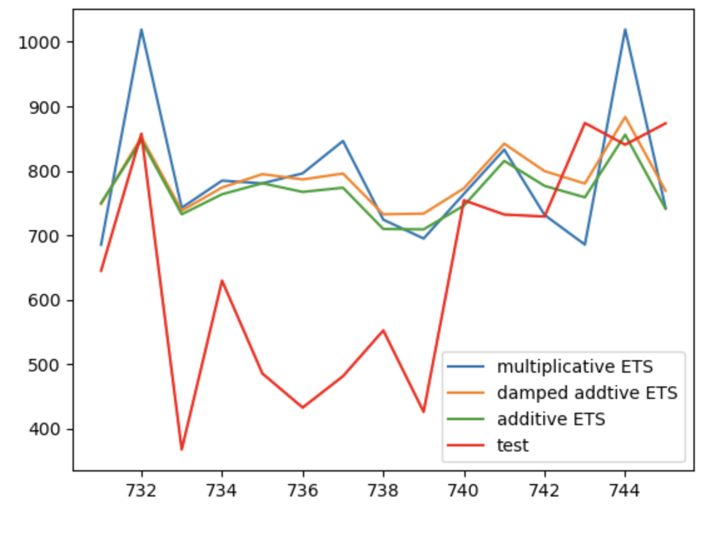
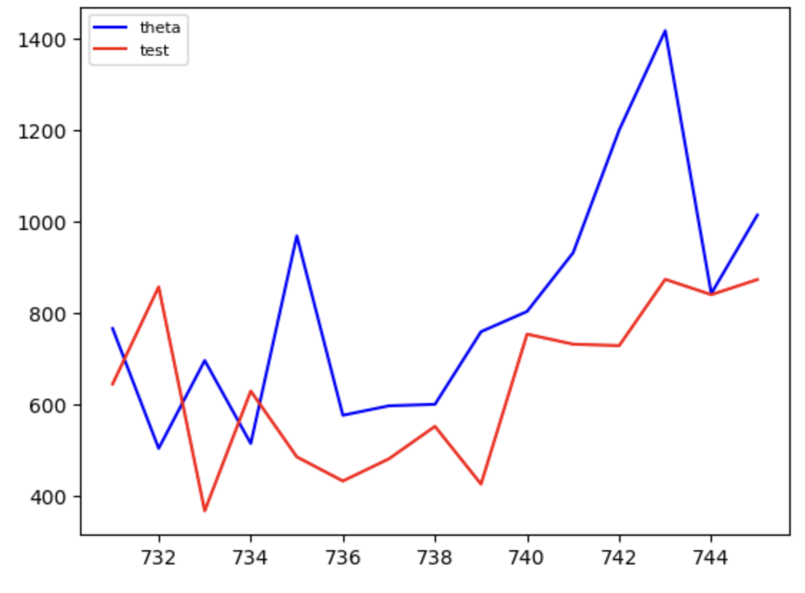

# Time Series Project: Wind Power Forecasting

## About the dataset 
This project focuses on renewable energy, particularly wind power, which is crucial for a sustainable future. The dataset comprises data from a specific windmill, including various weather conditions, turbine characteristics, and rotor features. The data spans from January 2018 to March 2020, with readings recorded at 10-minute intervals. The primary objective is to predict the mean daily wind power generation for the upcoming 15 days.

## Project Goal:
The goal is to develop a model using the training data (train.csv) that can accurately forecast the mean daily wind power generation for the next 15 days. The target variable for our predictions is ActivePower from the training set. Model performance will be evaluated using the Root Mean Square Error (RMSE).

## Project Description
This project involves fitting time series models using Python, with a focus on ARIMA, ETS, and Theta models.
 
## Structure of the Analysis:
**1. Initial Exploratory Analysis:** 
- Checking for null values.
- Resampling the dataset to daily frequency.
- Data cleaning and preprocessing.

**2. Data Characteristics:** 
Analyzing the data to determine stationarity and seasonality through visualization

**3. Model Implementation:** 
- ARIMA: Due to high computational demands, implemented with time constraints.
- ETS: Experimentation with various models, considering trends and seasonality.
- Theta: Application of the Theta method.

**4. Model Evaluation:** 
- Comparing each model's forecasts against the test set.
- Visualizing results to assess model accuracy.

## Results and Visualizations
**1. ARIMA Model:** 
The ARIMA model predictions (in blue) closely follow the trend of the test data, although it seems to underfit during certain peaks and troughs, suggesting potential for further optimization of the model parameters.

  

**2. ETS Models:** 
Compared three variations of the Exponential Smoothing State Space model:
- Multiplicative ETS (in blue) captures the seasonal fluctuations and overall trend well.
- Damped Additive ETS (in orange) tends to underpredict the peaks but adjusts better to the low points.
- Additive ETS (in green) shows a balanced approach between the multiplicative and damped models, aligning closely with the test data.

  

  
**3. Theta Model:** 
The Theta model (in blue) offers a surprisingly good fit with the overall pattern of the test data, although it overestimates during certain periods, indicating a need for parameter tuning.

  

## Model Assessment & Key Learning 

**Challenges in Capturing Volatility:**

Our analysis demonstrates the inherent challenge in forecasting the volatile nature of wind power generation. Each model exhibits unique strengths and limitations, underscoring the necessity of careful model selection and parameter tuning.

**Model Selection Insights:** 
No single model consistently outperforms others across all scenarios. In real-world applications, future values are unknown, making it impossible to use test RMSE as a model selection criterion, as one would not have access to future data. This introduces an element of chance in how well a chosen model will perform against unseen data.

**Strategic Approach to Forecasting:**
Forecasts should be tailored to the specific time horizon and trend considerations:
- For short-term forecasting, local fluctuations are critical, and higher orders of p and q in ARIMA models can capture these nuances, while the trend may be less significant.
- For long-term forecasting, accurately estimating the trend becomes crucial. This may involve using polynomial trends, linear regression, or other techniques to hone the model's long-term predictive capabilities.
- In both cases, accurately modeling seasonality is vital when it is present in the data.

**Model Improvement Tactics:**
It is essential to review prediction plots to identify components that the model fails to predict accurately. This can reveal areas for improvement, whether they be long-term trends, seasonality, or random noise. Iterative refinement based on these insights can lead to enhanced model performance.

## Files and Directories:
- README.md: Contains the project description.
- images/: Directory containing all images and visualization files.
- Time_Series_code.ipynb: Jupyter Notebook with project code.

## Authors:
- Yen Phan

